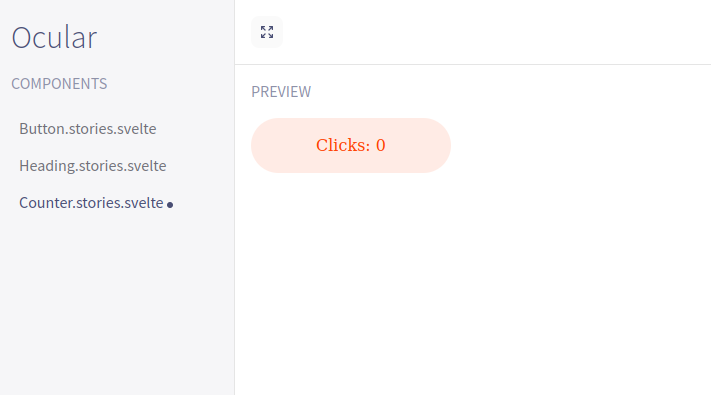

> **Warning**
> The project is still in it's experimental phase. There might be missing features and the API will be subjected to changes

# OcularBook for Svelte with Vite

Built with Svelte + TS + Vite + HeroIcons

Freaking fast! ⚡⚡ (Thanks to Vite and Svelte)

### Getting started

1. Install dependency from npm to your existing Svelte+Vite project

    ```
    pnpm add ocularbook
    ```

    ```
    yarn add ocularbook
    ```

    ```
    npm install ocularbook
    ```

2. Configure the ocularbook script to start Ocularbook on your project.

    ```
    npx ocularbook-configure
    ```

3. Start Ocularbook

    ```
    pnpm run ocularbook
    ```

    ```
    yarn run ocularbook
    ```

    ```
    npm run ocularbook
    ```

Add files in ending with `stories.svelte` (eg: `Counter.stories.svelte`) to your project to preview them with Ocularbook



### Features

- Preview svelte files matching `*.stories.svelte`
- Hot Module Replacement
- Add Global Configuration via `.ocularbook/Global.svelte`

#### Global configuration via Global.svelte

The following is an example Global.svelte which does a few things,

- Imports external resources
- Sets the title of the page
- Sets global CSS styles

```html
<svelte:head>
  <!-- Updates page title -->
  <title>Updated Title</title>

  <!-- Imports external resources from the html head -->
  <link rel="preconnect" href="https://fonts.googleapis.com" />
  <link rel="preconnect" href="https://fonts.gstatic.com" crossorigin="anonymous" />
  <link href="https://fonts.googleapis.com/css2?family=Poppins&display=swap" rel="stylesheet" />
</svelte:head>

<style>
  /* Updates global html styles */
  :global(html) {
    font-family: "Poppins", sans-serif;
    background: #eee;
    color: #201d30;
  }
</style>
```
